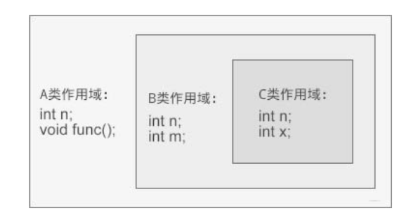
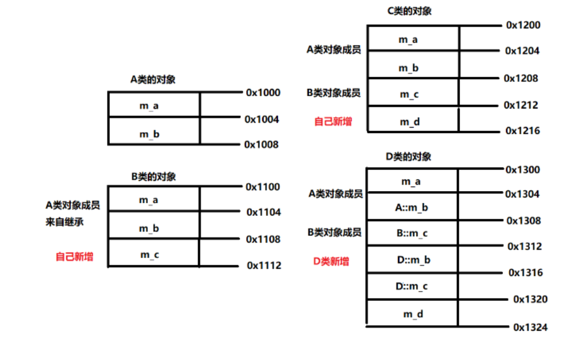
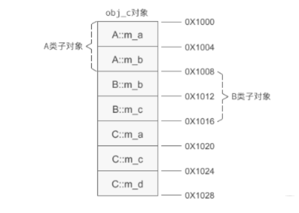
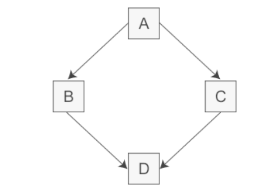
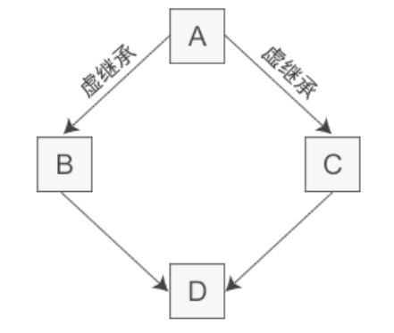
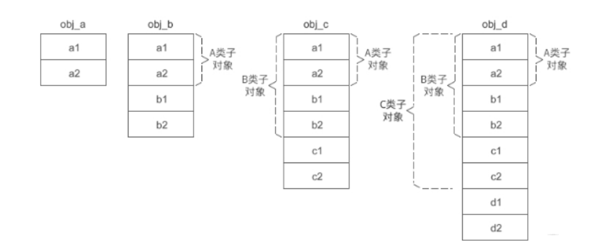
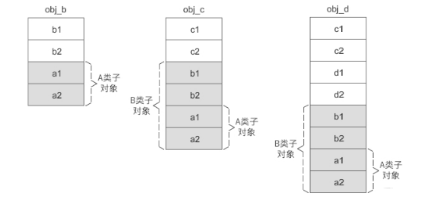
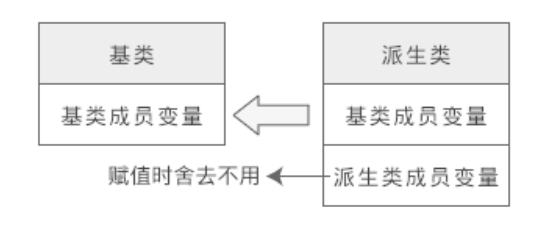
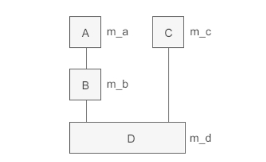
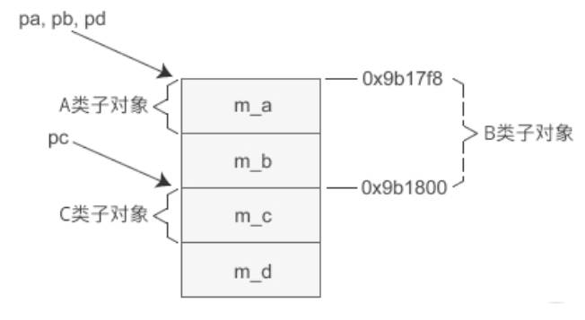

# 一、初识继承和派生
1. 封装：隐藏对象的属性和实现细节，仅仅对外公开接口，控制对类属性的读取和修改。
2. 继承：子类继承父类的特征和行为，使得子类具有父类的成员变量和方法。
3. 多态：同一个行为具有多个不同表现形式或形态的能力。

这章主要是探讨继承，再来看看继承的一些东西。

继承就是一个类从另一个类获取成员变量和成员函数的过程。因此被继承的类也叫父类或基类，而继承的类也叫子类或派生类。

派生类除了拥有父类的成员，还可以定义自己的成员，增加功能，这样可以实现代码的复用。

两个典型使用继承的场景：
1. 创建的子类和原本的基类很相似，只多了一些成员变量和成员函数的时候，就可以用继承来减少代码量，而且子类也会拥有基类的所有功能；
2. 创建多个类，他们拥有很多相似的从成员变量或函数，可以用继承将这些类共同的成员提取出来，定义为基类，然后每个类从基类中继承，这样可以减少代码量；

语法：
```c++
class 派生类名: [继承方式] 基类名{
    派生类新增的成员
};
```

例子：
```c++
#include <iostream>
#include <string>
using namespace std;

class People{
public:
    void setname(string name);
    string getname();
private:
    string m_name;
};

void People::setname(string name){m_name = name;}
string People::getname(){return m_name;}

class Student: public People{  // 继承Person类的所有成员
public:
    void setage(int age);   // 添加派生类的自己的成员变量
    int getage();
private:
    int m_age;
};

void Student::setage(int age){m_age = age;}
int Student::getage(){return m_age;}

int main(){
    Student stu;
    stu.setname("hukai");
    stu.setage(25);
    cout << stu.getname() << "的年龄是" << stu.getage() << endl;
    return 0;
}
```

# 二、继承的三种方式
继承方式总共有public、private、protected三种。

先回顾下类成员的访问权限从高到低依次是：public->protected->private，public可以通过对象访问也可以类内访问；private不能通过对象访问，只能类内访问；protected也不能通过对象访问，不过基类中的protected成员可以在派生来中访问，但是基类的private成员不能在派生类中使用。

三种不同的继承方式影响基类成员在派生类中的访问权限：
* public继承方式
  * 基类中所有的public成员继承到派生类中的public属性
  * 基类中所有的protected成员继承到派生类中的protected属性
  * 基类中所有的private成员在派生类无法访问
* protected继承方式
  * 基类所有的public成员继承到派生类中的protected属性
  * 基类中所有protected成员继承到派生类中的protected属性
  * 基类中所有的private成员在派生类中无法访问
* private继承方式
  * 基类中所有public成员继承到派生类中的private属性
  * 基类中所有protected成员继承到派生类中的private属性
  * 基类中所有private成员在派生类中无法访问
规则：
1. 基类成员在派生类中的访问权限不得高于继承方式（public、protected、private）；
2. 不管怎么继承，基类中的private成员在派生类中都无法访问，所以如果希望基类的一些成员在派生类中可以使用的话，需要将那些成员定义在基类的public或protected中，如果不希望在派生类中使用的话，需要将其定义在private中；
3. 如果希望基类的成员既不能通过对象访问，但是又可以在派生类中使用，那么就将这个成员定义在基类的protected中；
4. 在派生类中访问基类的private成员的唯一方法就是借助基类的非private成员函数；

不过通过using关键字可以修改基类成员在派生类中的访问权限，比如将public改为private，protected改为public等。

但是要注意：using关键字只能修改基类的public或protected成员的访问权限，不能改变private成员的访问权限，因为基类的private成员在派生类中是不可见的，根本无法访问。
```c++
#include <iostream>
#include <string>
using namespace std;

class People{
public:
    void setname(string name);
    string getname();
    void setage(int age);
    int getage();
    void setsex(string sex);
    string getsex();
    void setwork(string work);
    string getwork();

    string m_sex;
protected:
    string m_work;
private:
    string m_name;
    int m_age;
};

void People::setname(string name){m_name = name;}
string People::getname(){return m_name;}
void People::setage(int age){m_age = age;}
int People::getage(){return m_age;}
void People::setsex(string sex){m_sex = sex;}
string People::getsex(){return m_sex;}
void People::setwork(string work){m_work = work;}
string People::getwork(){return m_work;}

class Student: public People{  // 继承Person类的所有成员
public:
    void setscore(float score);
    float getscore();

    string helloname();
    string hellowork();
    string hellosex();

    using People::m_work;  // 将基类的m_work（protected）权限变为public权限  protected -> public
private:
    float m_score;
    using People::m_sex;  // 将基类的m_sex（public）权限变为private权限      public -> private
};

void Student::setscore(float score){m_score = score;}
float Student::getscore(){return m_score;}

string Student::hellosex(){return "hello, " + m_sex;}    // 访问基类的public属性
string Student::hellowork(){return "hello, " + m_work;}  // 访问基类的protected属性
// string Student::helloname(){return "hello, " + m_name;}  // 访问基类的private属性  报错 'std::__cxx11::string People::m_name' is private within this context

int main(){
    Student stu;
    stu.setname("hukai");
    stu.setsex("man");
    stu.setwork("student");
    stu.setage(25);
    stu.setscore(99.5);
    // hukai的年龄是25, 性别是man, 职业是student, 成绩是99.5
    cout << stu.getname() << "的年龄是" << stu.getage() << ", 性别是" << stu.getsex() << ", 职业是" << stu.getwork() << ", 成绩是" << stu.getscore() << endl;
    
    // 直接通过对象访问
    // cout << stu.m_sex << endl;  // 'std::__cxx11::string People::m_sex' is inaccessible within this context
    cout << stu.m_work << endl;    // student
    return 0;
}
```
using修改的是派生类对象的访问权限，派生类的成员变量和成员函数的访问权限还是原先的。并且只能修改public和protected两种权限。

# 三、继承过程中的名字遮蔽问题和作用域嵌套
名字遮蔽：派生类的成员和基类的成员重名（如果是成员函数则需要函数名字相同且形参也相同），那么在派生类中使用这个成员实际上用的是派生类的成员，而不是从基类中继承来的。

当发生名字遮蔽时使用基类的成员函数的一种方法（加上类名和域解析符）: stu.Person::show();

类的作用域嵌套
```c++
#include <iostream>
#include <string>
using namespace std;

class A{
public:
    void func();
    int n = 500;
};
void A::func(){ cout<<"hello, changjinhu!!!"<<endl; }
class B: public A{
public:
    int n = 5000;
    int m;
};
class C: public B{
public:
    int n = 50000;
    int x;
};
int main(){
    C obj;
    cout << obj.n << endl;   // 50000
    obj.func();              // hello, changjinhu!!!
    return 0;
}
```
这个例子的关系：B继承A，C继承B,那么他们的作用域嵌套关系如下：


1. obj是C类的对象，访问成员变量n时，会先到C类中找找到了就不会去B和A中找，即发生名字遮蔽；
2. 访问成员函数func()时，编译器先去C类中找，没找到，再继续去B中找，也没找到，再继续到A中找，找到了，调用A类作用域的func()函数;
   
# 四、继承时的对象内存模型
没有继承时对象的成员变量和成员函数是分开存储的：
1. 对象的内存中只包含成员变量，存储在栈区或堆区（new）
2. 成员函数与成员分开存储，存储在代码区

有继承的时候，派生类的内存模型可以看成是基类成员变量和新增成员变量的总和，所有成员变量仍然存储在代码区，由所有对象共享。
```c++
class A{
public:
    A(int a, int b);

protected:
    int m_a;
    int m_b;
};
A::A(int a, int b): m_a(a), m_b(b){}

class B: public A{
public:
    B(int a, int b, int c);
private:
    int m_c;
    
};

// 这种参数初始化应该是这么写
B::B(int a, int b, int c): A(a, b), m_c(c){}

class C: public B{
public:
    C(char a, int b, int c, int d);
private:
    int m_d;
};
C::C(char a, int b, int c, int d): B(a, b, c), m_d(d){}

// 成员遮蔽的情况
class D: public B{
public:
    D(char a, int b, int c, int d);
private:
    int m_b;    // 遮蔽A类的成员变量
    int m_c;    // 遮蔽B类的成员变量
    int m_d;    // 新增成员变量
};
D::D(char a, int b, int c, int d): B(a, b, c), m_b(b), m_c(c), m_d(d){}
```
上面例子写了4个类，A类是最基类有成员变量m_a和m_b，B继承A新增成员变量m_c, C继承B新增成员变量m_d, D继承B新增成员变量m_b、m_c、m_d, 前面两个变量发生了遮蔽。

好了搞清楚了他们的关系，那么他们在内存当中是怎么存储的呢？




1. 派生类的对象模型中，会包含所有基类的成员变量，但如果想在派生类中通过成员函数访问到，必须将基类的成员变量声明为public或protected；
2. 内存中存储时基类的成员变量会排在前面，派生类的成员变量会排在后面；
3. 如果想在派生类的构造函数通过参数化列表给基类的成员变量赋值，此时需要借助基类的构造函数才行，否则会报错；


# 五、C++基类和派生类的构造函数和析构函数
## 5.1、构造函数
基类的成员函数可以被派生类继承，但是基类的构造函数是不能被继承的。

在设计派生类时，对继承过来的基类的成员变量的初始化也需要由派生类的构造函数来完成，但是大部分基类都有private属性的成员变量，在派生类中无法直接访问，此时就需要在派生类的构造函数中调用基类的构造函数来完成初始化。

例子：
```c++
#include <iostream>
#include <string>
using namespace std;

class People{
public:
    People(string name, int age);
protected:
    string m_name;
    int m_age;
};
People::People(string name, int age): m_name(name), m_age(age){}

class Student: public People{
public:
    Student(string name, int age, float score);
    void display();
private:
    float m_score;
};
//People(name, age)是调用基类的构造函数
Student::Student(string name, int age, float score): People(name, age), m_score(score){}
void Student::display(){
    cout << m_name << m_age << m_score << endl;
}

int main(){
    Student stu("zhongqaing", 25, 100);
    stu.display();
    
    return 0;
}
```
上面例子中给基类的成员变量初始化时调用的基类的构造函数People(name, age)，并且将派生类的形参string name, int age作为实参传递给基类的构造函数。

关于构造函数的调用顺序：基类的构造函数总是优先调用，即创建派生类的对象时，先调用基类的构造函数，再调用派生类的构造函数。比如继承关系：B继承A,C继承B,那么创建C类对象的构造函数执行顺序：A类构造函数->B类构造函数->C类构造函数。实际上C是只调用了B的构造函数（不会调用A的构造函数），而B只调用了A的构造函数，防止重复调用，重复初始化。

## 5.2、析构函数
和构造函数一样，析构函数也不会被继承，但派生类的析构函数中不用显式调用基类的析构函数，析构函数的执行顺序和构造函数的执行顺序恰好相反:
1. 创建派生类对象时，构造函数的执行顺序和继承顺序相同，先执行基构造函数，再执行派生类构造函数
2. 销毁派生类对象时，析构函数执行顺序和继承顺序相反，先执行派生类析构函数，再执行基类析构函数


# 六、C++多继承
派生类只继承一个基类叫单继承，派生类继承多个基类叫多继承。（C++中有多继承，JAVA中取消了多继承，多继承容易造成代码逻辑混乱）

多继承语法：
```c++
class D: public A, private B, protected C{
    //类D新增加的成员
}
```
## 6.1、多继承时的构造函数和析构函数
多继承下的构造函数：多继承的派生类的构造函数中，需要调用多个基类的构造函数。
调用顺序：和声明派生类时基类出现的顺序相同，如上面调用顺序为：A、B、C、D。
同理析构函数和构造函数调用的顺序相反：D、C、B、A。
但是当两个或多个基类有相同的成员时，如果直接访问会造成命名冲突，这时要在成员名前面加上基类名和域解析符::，显式的指明使用哪个类的成员。
```c++
#include <iostream>
#include <string>
using namespace std;

class BaseA{
public:
    BaseA(int a, int b);
    ~BaseA();
    void show();
protected:
    int m_a;
    int m_b;
};
BaseA::BaseA(int a, int b):m_a(a), m_b(b){
    cout << "BaseA contructor" << endl;
}
BaseA::~BaseA(){
    cout << "BaseA destructor" << endl;
}
void BaseA::show(){
    cout << "m_a = " << m_a << endl;
    cout << "m_b = " << m_b << endl;
}

class BaseB{
public:
    BaseB(int c, int d);
    ~BaseB();
    void show();
protected:
    int m_c;
    int m_d;
};
BaseB::BaseB(int c, int d):m_c(c), m_d(d){
    cout << "BaseB constructor" << endl;
}
BaseB::~BaseB(){
    cout << "BaseB destructor" << endl;
}
void BaseB::show(){
    cout << "m_c = " << m_c << endl;
    cout << "m_d = " << m_d << endl;
}

class BaseC: public BaseA, public BaseB{
public:
    BaseC(int a, int b, int c, int d, int e);
    ~BaseC();
    void show();
private:
    int m_e;
};
BaseC::BaseC(int a, int b, int c, int d, int e):BaseA(a, b), BaseB(c, d), m_e(e){
    cout << "BaseC constructor" << endl;
}
BaseC::~BaseC(){
    cout << "BaseC destructor" << endl;
}
void BaseC::show(){
    BaseA::show();   // 多个基类成员（函数）名字相同，要用域解析符::明确是哪个基类的成员函数
    BaseB::show();
    cout << "m_e = " << m_e << endl; 
}

int main(){
    BaseC c(1, 2, 3, 4, 5);
    c.show();
    return 0;
}

// 输出
BaseA contructor   // 调用基类的构造函数 顺序和声明派生类时基类出现的顺序相同
BaseB constructor
BaseC constructor  // 先调用基类构造函数 再调用派生类的构造函数
m_a = 1
m_b = 2
m_c = 3
m_d = 4
m_e = 5
BaseC destructor  // 析构函数的调用顺序和构造函数的调用顺序刚好相反
BaseB destructor
BaseA destructor
```
## 6.2、多构造函数时的对象内存模型
直接上例子：
```c++
#include <iostream>
#include <string>
using namespace std;

class A{
public:
    A(int a, int b);
protected:
    int m_a;
    int m_b;
};
A::A(int a, int b):m_a(a), m_b(b){}

class B{
public:
    B(int b, int c);
protected:
    int m_b;
    int m_c;
};
B::B(int b, int c):m_b(b), m_c(c){}

class C: public A, public B{
public:
    C(int a, int b, int c, int d);
    void show();
private:
    int m_a;
    int m_c;
    int m_d;
};
C::C(int a, int b, int c, int d):A(a, b), B(b,c), m_a(a), m_c(c), m_d(d){}
```
C继承自A和B，下面看看C的内存分布图：


可以看到C内部变量存放的顺序和构造函数调用的顺序是相同的。

# 七、C++虚基类和虚继承
## 7.1、虚基类和虚继承
多继承很容易产生命名冲突和冗余数据的问题，如下：



A类派生出B类和C类，D类又继承B和C类，那么D类就继承了2份A类的全部成员变量和成员函数，一份来自A->B->D，另一份来自A->C->D。一方面派生类保留了多份间接基类的成员，造成了冗余数据；另一方面还很容易造成命名冲突，编译器不知道该从哪条路径操作间接基类的成员（上面有两条路径）。

为了解决这个问题，就提出了虚继承。如下面的例子：
```c++
#include <iostream>
#include <string>
using namespace std;

class A{  // 间接基类A
protected:
    int m_a;
};

class B: virtual public A{  // 直接基类B
protected:
    int m_b;
};

class C: virtual public A{  // 直接基类C
protected:
    int m_c;
};

class D: public B, public C{  // 派生类D
public:
    void seta(int a){m_a = a;}  // 如果不是虚继承， 这里会报错，编译器不知道这个m_a走的是A->B->D还是A->C->D这条线  所以这么可以直接访问 编译器是知道该成员属于哪个类的
    void setb(int b){m_b = b;}
    void setc(int c){m_c = c;}
    void setd(int d){m_d = d;}
private:
    int m_d;
};
```



如上图，虚继承的目的就是为了让某个类做出声明，承诺共享它的基类。这个被共享的基类（间接基类）被称为**虚基类**，比如这里的A类。

声明了虚继承之后，不管虚基类在继承体系中出现了多少次，在派生类中都只会包含一份虚基类的成员。这样就避免了数据冗余和命名冲突的问题。

其实，多继承是不建议使用的，能用单继承解决的问题，尽量不要用多继承。（这也是Java等不支持多继承的原因）

## 7.2、虚继承的构造函数
普通的多继承的时候，派生类的构造函数只能调用直接基类的构造函数，无法调用间接基类的构造函数，不然就重复调用了。但是在含义虚基类的多继承时，间接基类（虚基类）的构造函数是由最终派生类的构造函数调用的。
```c++
#include <iostream>
#include <string>
using namespace std;

class A{  // 虚基类
public:
    A(int a);
protected:
    int m_a;
};
A::A(int a): m_a(a){ }

class B: virtual public A{  // 直接派生类B
public:
    B(int a, int b);
    void display();
protected:
    int m_b;
};
B::B(int a, int b): A(a), m_b(b){ }
void B::display(){
    cout << "m_a=" << m_a << ", m_b=" << m_b << endl;
}

class C: virtual public A{  // 直接派生类C
public:
    C(int a, int c);
    void display();
protected:
    int m_c;
};
C::C(int a, int c): A(a), m_c(c) { }
void C::display(){
    cout << "m_a=" << m_a << ", m_c=" << m_c << endl;
}

class D: public B, public C{  // 间接派生类D
public:
    D(int a, int b, int c, int d);
    void display();
private:
    int m_d;
};
D::D(int a, int b, int c, int d): A(a), B(90, b), C(100, c), m_d(d) { }
void D::display(){
    cout << "m_a=" << m_a << ", m_b=" << m_b << ", m_c=" << m_c << ", m_d=" << m_d << endl;
}

int main(){
    B b(10, 20);
    b.display();

    C c(30, 40);
    c.display();

    D d(50, 60, 70, 80);
    d.display();

    return 0;
}

// 输出
m_a=10, m_b=20
m_a=30, m_c=40
m_a=50, m_b=60, m_c=70, m_d=80
```
如上例，D的构造函数除了调用直接基类B和C的构造函数，还调用了间接基类A的构造函数。而在普通的多继承中，派生类的构造函数只负责初始化它的直接基类，再由直接基类构造函数初始化间接基类。

另外虚继承的构造函数的执行顺序和普通的继承顺序也不同。在最终派生类的构造函数的调用列表中，编译器首先调用虚基类的构造函数，再按照声明继承时各个基类出现的顺序调用他们的构造函数。如上图：A->B->C->D。


## 7.3、虚继承的内存模型
对于普通继承，基类成员变量始终在派生类成员变量前面。

如这个单继承的例子：
```c++
class A{
protected:
    int m_a1;
    int m_a2;
};
class B: public A{
protected:
    int b1;
    int b2;
};
class C: public B{
protected:
    int c1;
    int c2;
};
class D: public C{
protected:
    int d1;
    int d2;
};
int main(){
    A obj_a;
    B obj_b;
    C obj_c;
    D obj_d;
    return 0;
}
```
它的内存模型非常简单：


A是最顶层的基类，在派生类B、C、D的对象中，A类的成员总是为于最前面...

但是如果上面的A类是B类的虚基类，B是C的虚基类，那么各个对象的内存模型就变成了这样：


可以看到不管是虚基类的直接派生类还是间接派生类，虚基类的成员都位于派生类的对象的最后面。

# 八、派生类和基类之间的类型转换
C++中经常方式类型转换，如int->float，编译器会先将int类型数据转换为float，再进行赋值。类也是一种数据类型，也可以发生数据转换，但是这种转换只有在基类和派生类之间才有意义，并且只能将派生类赋值给基类（对象，指针，引用），在C++中这种转换称为向上转型。

## 8.1、派生类对象赋值给基类对象
```c++
class A{  //基类
public:
    A(int a);
public:
    void display();
public:
    int m_a;
};
A::A(int a): m_a(a){ }
void A::display(){
    cout<<"Class A: m_a="<<m_a<<endl;
}

class B: public A{  //派生类
public:
    B(int a, int b);
public:
    void display();
public:
    int m_b;
};
B::B(int a, int b): A(a), m_b(b){ }
void B::display(){
    cout<<"Class B: m_a="<<m_a<<", m_b="<<m_b<<endl;
}

int main(){
    A a(10);
    B b(66, 99);
    //赋值前
    a.display();
    b.display();
    cout<<"--------------"<<endl;
    //赋值后
    a = b;
    a.display();
    b.display();
    return 0;
}

// 结果
Class A: m_a=10
Class B: m_a=66, m_b=99
----------------------------
Class A: m_a=66    // 这里注意，a的成员m_a的值已经变了
Class B: m_a=66, m_b=99
```
这里B继承A,由于派生类B包含了从基类A继承过来的成员，所以可以将派生对象b赋值给基类对象a。此时a.display()调用的a的成员函数，访问的却是b继承过来的成员变量。

赋值的本质：将现有数据写入已分配好的内存，对象的内存只包含成员变量，所以对象之间的赋值是成员变量之间的赋值，成员函数之间是不存在赋值的问题的。
所以对象之间的赋值只关系到成员变量，和成员函数和this指针没有关系。

将派生类对象赋值给基类对象时，会舍去派生类新增的成员，如下图：



从上面的例子就可以发现，即便将派生类对象赋值给了基类对象，基类对象也不会包含派生类的成员，如上面的例子，a.m_a是正确的，a.m_b是错误的，因为基类对象a根本不包含派生类对象b的成员m_b。

## 8.2、派生类指针赋值给基类指针
例子：
```c++
class A{  //基类A
public:
    A(int a);
public:
    void display();
protected:
    int m_a;
};
A::A(int a): m_a(a){ }
void A::display(){
    cout<<"Class A: m_a="<<m_a<<endl;
}

class B: public A{  //中间派生类B
public:
    B(int a, int b);
public:
    void display();
protected:
    int m_b;
};
B::B(int a, int b): A(a), m_b(b){ }
void B::display(){
    cout<<"Class B: m_a="<<m_a<<", m_b="<<m_b<<endl;
}

class C{  //基类C
public:
    C(int c);
public:
    void display();
protected:
    int m_c;
};
C::C(int c): m_c(c){ }
void C::display(){
    cout<<"Class C: m_c="<<m_c<<endl;
}

class D: public B, public C{  //最终派生类D
public:
    D(int a, int b, int c, int d);
public:
    void display();
private:
    int m_d;
};
D::D(int a, int b, int c, int d): B(a, b), C(c), m_d(d){ }
void D::display(){
    cout<<"Class D: m_a="<<m_a<<", m_b="<<m_b<<", m_c="<<m_c<<", m_d="<<m_d<<endl;
}
int main(){
    A *pa = new A(1);
    B *pb = new B(2, 20);
    C *pc = new C(3);
    D *pd = new D(4, 40, 400, 4000);
    pa = pd;    // pa指针指向pd
    pa -> display();  
    pb = pd;    // pb指针指向pd
    pb -> display();
    pc = pd;    // pc指针指向pd
    pc -> display();
    cout<<"-----------------------"<<endl;
    cout<<"pa="<<pa<<endl;
    cout<<"pb="<<pb<<endl;
    cout<<"pc="<<pc<<endl;
    cout<<"pd="<<pd<<endl;
    return 0;
}

// 结果如下
Class A: m_a=4
Class B: m_a=4, m_b=40
Class C: m_c=400
-----------------------
pa=0xfb4b40
pb=0xfb4b40
pc=0xfb4b48
pd=0xfb4b40
```

画出他们之间的关系：



上面的例子，尝试将派生类指针赋值给基类指针，与对象变量赋值不同的是，对象指针之间并没有拷贝对象的成员，也没有修改对象本身的数据，仅仅是改变了指针的指向。

注意两者的区别：对象赋值其实是拷贝对象的成员变量，而对象指针赋值仅仅是改变指针的指向。

1. 基类指针访问派生类的成员：如上pa=pd,pa->display();这里将派生类指针赋值给了基类指针pa，pa->display()使用的是D类对象pd的成员变量，但是调用的成员函数确是基类的成员函数pa->display()。为什么？
   首先pa是A类的指针，指向的是D类的对象（地址），所以访问的时候，是访问D类的成员变量；但是D的对象（地址）中只存储了成员变量，并没有存储成员函数，成员函数是通用的（基类的），所以这里调用的还是基类的成员函数pa->display();
   总结：编译器通过指针指向访问成员变量，指针指向哪个对象就使用哪个对象的数据；编译器通过指针的类型访问成员函数，指针属性哪个类就调用哪个类的成员函数；
2. 赋值前后不一致：如上的pc=pd,pc->display()，可以发现同样都是将最终派生类的指针赋值给基类指针pa,pb,pc，正常来说，他们都是指向同一个内存，那么运行的内存地址值应该是相等的，但是发现pc的情况会比较特殊，pc的地址和pd是不一样的，有一点点区别（0xfb4b48和0xfb4b40），为什么呢？
   赋值是将一个变量的值交给另一个变量，但注意，赋值之前，编译器可能对值先进行处理，比如将double类型赋值给int类型，编译器会先抹掉小数部分，然后再赋值，这就导致赋值前后的值有一点差别。派生类指针赋值给基类也同理，编译器可能在赋值前先进行处理：
   
3. 对象的指针必须指向对象的起始位置。对于A类和B类来说，他们的对象的起始位置和D类对象的起始位置相同，因为他们都有m_a成员变量，所以将pd指针赋值给pa指针和pb指针时编译器不需要进行任何调整，但是C类对象没有m_a成员变量，他的第一个成员就是m_c,它距离D类对象的开头是有一定的偏移的，所以pd指针赋值给pc指针的时候，编译器会先对pd指针进行调整，将pd指针先指向m_c变量的位置，再赋值给pc指针，所以最终就导致了pc指针相对pd指针出现了一个偏移的现象。

## 8.3、派生类引用赋值给基类引用
引用本质上通过指针方式实现，基类的指针可以指向派生类对象，那么基类的引用也指向派生类对象，表现和指针类型。
   
这个就不详细整理了， 引用仅仅是指针简单封装， 只需要注意， 向上转型通过基类的对象，指针和引用只能访问从基类继承过去的成员(成员变量和成员函数)，不能访问派生类新增的成员。