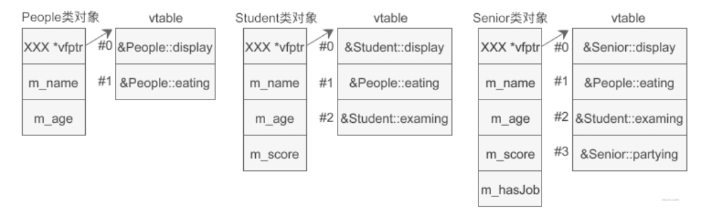

# 一、多态和虚函数初识
从上一篇可以知道：基类指针指向派生类对象时，成员变量使用的是派生类的成员变量，但是成员函数还是使用的基类的成员函数。
例子：
```c++
#include <iostream>
#include <string>
using namespace std;

class base{
public:
    base(string name);
    void display();
protected:
    string m_name;
};
base::base(string name): m_name(name){ }
void base::display(){ cout << "嗨 " << m_name << ", 我是基类！！！" << endl;}

class paisheng: public base{
public:
    paisheng(string name, int age);
    void display();
private:
    int m_age;
};
paisheng::paisheng(string name, int age): base(name), m_age(age){ }
void paisheng::display(){
    cout << "嗨 " << m_name << ", 我是派生类，今年" << m_age << "岁" <<endl;
}

int main(){
    base *p = new base("hukai");
    p -> display();   // 嗨 hukai, 我是基类！！！

    p = new paisheng("hukaiming", 25);  
    p -> display();   // 嗨 hukaiming, 我是基类！！！
    return 0;
}
```
从上面的例子也可以看到，结果雀氏如此：基类指针指向派生类对象后，成员变量变成了派生类的成员变量，但是成员函数调用的还是基类的成员函数。
总结：基类指针只能访问派生类的成员变量，并不能访问派生类的成员函数。

那么有没有办法让基类的指针访问派生类的成员函数呢？那么这里就需要虚函数了。

虚函数的使用很简单,在函数声明前面加一个virtual关键字即可(还是上面的例子)：
```c++
class base{
public:
    base(string name);
    virtual void display();
protected:
    string m_name;
};

//结果立马见效
嗨 hukai, 我是基类！！！
嗨 hukaiming, 我是派生类，今年25岁
```

总结：有了虚函数，基类指针指向基类对象时就可以使用基类的成员变量和成员函数，指向派生类对象时也可以使用派生类的成员变量和成员函数。即基类指针既可以按照基类的方式做事，也可以按照派生类的方式做事，具有多种表现形式，这种现象就叫做多态。

一般的指针调用成员函数是根据指针类型来判断调用哪个类的成员函数的，但是虚函数这里好像不是这样的，**虚函数是根据指针指向的调用的，和成员变量一样，指针指向哪个类对象就调用哪个类的虚函数。**

C++中虚函数的唯一作用就是构成多态，那么多态的作用是什么？我为什么要通过基类的指针访问派生类对象的成员呢？我直接用派生类对象访问派生类的成员不好吗？下面来说说多态的作用。
先大白话回顾下C++面向对象的三大特性：封装、继承、多态。
1. 封装：把核心数据和函数包装起来，细节隐藏起来，对外只提供接口，使函数高度模块化；
2. 继承：可以对已经存放的代码重复使用，对于很多类共有的功能，不需要在每个类中都写，把公共的部分抽象出来，组成基类，其他的类继承自这个基类，共享这些公共的部分；（派生类可以使用基类的功能）
3. 多态：使派生类的功能可以被基类调用，向后兼容，提高扩展性和可维护性。（基类可以使用派生类的功能）

假如有这样一个场景：生活当中有自行车、汽车、火车、飞机等不同的交通工具，我们可以用代码将他们抽象成不同的类，每个类都有自己的运行方式，那么我们现在要设计这么一个系统，遇到不同的交通工具，就调用对应的交通方式的运行方式让我们外出，应该怎么做？
1. 一个思路：把每个交通工具类定义出来，有自己的run方法。然后我们选择的时候通过已知的交通方式选择对应的类执行run方法，所以会写很多很多的if判断语句。如果有新的交通工具加入，还要在函数体中加if判断。这种方法的耦合度太高了，非常不可取；
2. 另一种就是多态的思路：可以先声明一个base的交通工具类，里面定义一个虚函数run方法，然后其他的具体的交通工具就继承这个base交通工具，再重写各自的run方法。实际调用时，先创建一个base指针，去接受对应交通工具类的对象，再执行这个base指针的run方法时呢，根据多态性质，调用的其实是这个交通工具类的run方法。感受到多态的强大之处了吧！！！

下面代码实现感受下：
```c++
#include <iostream>
#include <string>
using namespace std;

class vehicle{
public:
    virtual void run();
};
void vehicle::run(){cout << "我是交通工具基类！！！" << endl;}

class bicycle: public vehicle{
public:
    void run();
};
void bicycle::run(){cout << "我是自行车！！！" << endl;}

class car: public vehicle{
public:
    void run();
};
void car::run(){cout << "我是汽车！！！" << endl;}

class train: public vehicle{
public:
    void run();
};
void train::run(){cout << "我是火车！！！" << endl;}

class people{
public:
    people(vehicle *);
    void drive();
private:
    vehicle *m_vehicle;
};
people::people(vehicle *v): m_vehicle(v){ }
void people::drive(){
    m_vehicle->run();
}

int main(){
    // 创建基类指针
    vehicle *v = new vehicle();  

    // 基类指针指向派生类对象
    v = new bicycle();  // 我是自行车！！！
    // v = new car();
    // v = new train();

    people *p = new people(v);
    p -> drive();  // 调用的其实是派生的成员函数
    return 0;
}
```
从这个例子就可以完全的感受多态的强大之处！在主函数中我们只需要选择相应的派生类对象到基类指针v中，在people中的drive()函数再调用run方法，通过多态的性质，他会自动匹配该调用哪个交通工具类的run方法（基类指针指向派生类就调用哪个类的虚函数）。其它的代码都不用管，只需要调用不同的派生类对象（替换这句话v = new bicycle();）即可，方不方便？

这也是解耦合的意思，新增某些功能或者交通工具类，不需要修改people里面的drive方法，使得people类和交通工具类的耦合度非常低，高内聚低耦合是软件设计的最终追求。

引用也可以实现多态，但是一般不用，不灵活，失去多态的本质。

# 二、虚函数的注意事项
关于虚函数，有几点需要注意的：
1. 只需要在函数声明的时候加上virtual关键字，就完成了虚函数的定义，函数定义处可以加也可以不加，我们一般不加；
2. 一般都是将基类中的函数命名为虚函数，那么所有派生类中具有遮蔽关系的同名函数都会变为虚函数；
3. 如果在基类中定义了虚函数，而派生类中却没有这个同名函数，那么将会使用基类的虚函数；
4. 只有当派生类的虚函数覆盖了基类的虚函数才能构成多态（基类指针指向派生类对象）。比如基类虚函数virtual void run(), 派生类虚函数virtual void run(int)， 那么基类指针指向派生类对象时，p->run(100)将会报错，因为此时会调用基类的虚函数，而不是调用派生类的虚函数；
5. 构造函数不能是虚函数。基类的构造函数仅仅在派生类的构造函数中调用，不同于继承。即派生类不能继承基类的构造函数，仅仅能在派生类的构造函数中调用一下基类的构造函数；
6. 析构函数可以作为虚函数，而且有时候必须要声明为虚函数（后面详说）；
   
# 三、构成多态的条件
构成多态必须要满足三个条件：
1. 必须存在继承关系，必须要有基类和派生类；
2. 继承关系必须要有同名的虚函数，他们是覆盖关系（同名、返回值和参数也相同）；
3. 存在基类的指针，该指针指向派生类的对象，然后通过这个基类指针取调用虚函数；

什么情况下应该将一个类声明为虚函数呢？
首先看下这个成员函数所在的类是否为基类，然后判断下这个成员函数在类继承后是否有可能会被经常的修改，如果经常可能会被修改，那么一般我们会将这个成员函数声明为虚函数。

# 四、构造函数为什么不能为虚函数？析构函数为什么有时候一定要为虚函数？
构造函数为什么不能为虚函数：
1. 派生类不能继承基类的构造函数，将构造函数声明为虚函数没有意义；
2. 构造函数是用于创建对象的初始化，在执行构造函数之前，对象尚未创建，虚函数表还不存在，没有指向虚函数表的指针，所以无法查询虚函数表，也就不知道调用哪个构造函数；（建议这里在看完下下节的虚函数表只后再看会更清晰点）

但是析构函数是应于销毁对象时的清理工作，它可以声明为虚函数，而且有时候必须声明为虚函数。

先看下下面这个例子：
```c++
#include <iostream>
#include <string>
using namespace std;

class Base{
public:
    Base();
    ~Base();
protected:
    char *str;
};
Base::Base(){
    str = new char[100];
    cout << "Base constructor" << endl;
}
Base::~Base(){
    delete[] str;
    cout << "Base destructor" << endl;
}

class Derived: public Base{
public:
    Derived();
    ~Derived();
private:
    char *name;

};
Derived::Derived(){
    name = new char[100];
    cout << "Derived constructor" << endl;
}
Derived::~Derived(){
    delete[] name;
    cout << "Derived destructor" << endl;
}

int main(){
    Base *pb = new Derived();  // 基类指针指向派生类对象
    delete pb; 

    cout << "-------------------" << endl;

    Derived *pd = new Derived();  // 派生类指针指向派生类对象
    delete pd;

    return 0;
}

// 结果
Base constructor
Derived constructor
Base destructor
-------------------
Base constructor
Derived constructor
Derived destructor
Base destructor
```
1. 从上例的结果来看，当基类指针指向派生类对象时，先会调用基类的构造函数再调用派生类的构造函数（这个是显而易见的，从前面一章继承和派生就知道的结论）；但是当删除这个基类指针时只调用基类的析构函数，没有调用派生类的析构函数。
2. 而当派生类指针指向派生类对象时，同样会先调用基类的构造函数再调用派生类的构造函数，但是在删除这个派生类指针时居然调用了派生类和基类两个析构函数。

我们知道如果不调用派生类的析构函数，那么会导致派生类name所指向的100个char类型的指针的内存空间得不到释放，这就是典型的C++的内存泄漏问题。

这里要搞清楚两个问题：
1. 为什么第一种也就是delete pb删除基类指针的时候，不会调用派生类的析构函数呢？
   因为这里的析构函数是非虚函数，通过指针指向非虚函数时，编译器会根据指针的类型来确定要调用的函数。即指针指针指向哪个类就调用哪个类的析构函数，所以这里只会调用基类的析构函数。
2. 为什么第二种delete pd删除派生类指针的时候，系统会调用派生类和基类的析构函数？
   这里pd是派生类的指针，编译器同样会根据它的指针类型来判断该此时应该调用派生类的析构函数，但是在执行派生类的析构函数的时候，派生类的析构函数又会调用基类的析构函数，这个过程是隐式的，所以大家可能都不知道。

那么如何让pb也调用派生类的析构函数呢？因为我们知道如果可以的话肯定会更好嘛，可以防止内存泄漏问题。解决的办法就是把基类的析构函数声明为虚函数。
还是上面的例子稍微改一下：
```c++
class Base{
public:
    Base();
    virtual ~Base();
protected:
    char *str;
};
// 结果
Base constructor   
Derived constructor
Derived destructor 
Base destructor    
-------------------
Base constructor   
Derived constructor
Derived destructor 
Base destructor 
```
从上面结果可以看到，将基类的析构函数声明为虚函数后，派生类的析构函数也自动称为虚函数。这个时候编译器会自动忽略指针的类型，而是根据指针的指向来选择函数。指针指向哪个类的对象，就调用哪个类的函数。所以这里pb调用的其实就是派生类的析构函数，又因为调用派生类的析构函数会自动的调用基类的析构函数（上面有提到），所以最后pb、pd指针都会调用派生类和基类的析构函数，防止内存泄漏。

总结：**在实际开发过程中，一旦我们使用构造函数创建了一个类的对象，当然就希望最后可以调用这个类的析构函数来进行清理工作，比如释放内存、关闭文件等等。但是如果同时这个类又是基类呢，就必须要先声明这个基类的析构函数是虚函数，否则就有内存泄漏的风险。所以在大部分情况下，基类的析构函数我们习惯的都会定义为虚函数。**

# 五、纯虚函数和抽象类
C++中还可以将虚函数定义为纯虚函数，语法：
```c++
virtual 返回值类型 函数名(函数参数) = 0;
```
纯虚函数没有函数体，只用函数声明，**在虚函数的函数声明最后结尾处加上 =0（注意不是说返回值为0） ,表明这个函数是纯虚函数。包含纯虚函数的类称为抽象类。**

之所以说是抽象类，是因为这个类无法实例化，无法创建对象。因为纯虚函数没有函数体，不是完整的函数，无法调用，无法为之分配内存空间。

抽象类一般都是基类，然后让派生类去实现纯虚函数。**派生类必须实现纯虚函数才能被实例化。**

```c++
#include <iostream>
#include <string>
using namespace std;

class Line{  // 线
public:
    Line(float len);
    virtual float area() = 0;
    virtual float volume() = 0;
protected:
    float m_len;
};
Line::Line(float len):m_len(len){ }

class Rec: public Line{  // 矩形
public:
    Rec(float len, float width);
    float area();
protected:
    float m_width;
};
Rec::Rec(float len, float width): Line(len), m_width(width){ }
float Rec::area(){return m_len * m_width;}

class Cuboid: public Rec{  // 长方体
public:
    Cuboid(float len, float width, float height);
    float area();
    float volume();
protected:
    float m_height;
};
Cuboid::Cuboid(float len, float width, float height):Rec(len, width), m_height(height){ }
float Cuboid::area(){return 2 * (m_len*m_width + m_len*m_height + m_width*m_height);}
float Cuboid::volume(){return m_len*m_width*m_height;}

int main(){
    // Line * q = new Rec(10, 20); // 不允许使用抽象类类型 "Rec" 的对象:
    Line *p = new Cuboid(10, 20, 30);
    // Line * q = new Rec(10, 20); // 不允许使用抽象类类型 "Rec" 的对象
    cout << "The area of Cuboid is " << p->area() << endl;
    cout << "The volume of Cuboid is " << p->volume() << endl;
    return 0;
}

// 输出
The area of Cuboid is 2200
The volume of Cuboid is 6000
```
简单分析下：Line是顶层的基类，里面有两个纯虚函数，所以Line是一个抽象类。Rec继承Line，实现了area()函数，但因为继承了Line类，所以此时Rec类还有一个纯虚函数volume()没有实现，所以Rec类也是一个抽象类，所以不能进行实例化,所以执行main函数第一句时会报错”不允许使用抽象类类型“。然后Cuboid类继承了Rec类，实现了volume()虚函数，这样，Cuboid类才能算一个完整的类，所以Cuboid类可以被实例化。
总结下，最顶层的基类Line是个抽象类（两个纯虚函数area()、volume()），无法进行实例化；中间的Rec类也是个抽象类（1个纯虚函数volume()），也无法进行实例化；Cuboid类不是抽象类，可以进行实例化。

什么情况下会使用纯虚函数：**实际开发中可以定义一个抽象类，只完成部分功能，未完成的功能交给派生类实现，这部分未完成的功能，往往是基类不需要的，或者基类无法实现的。**

抽象基类除了约束派生类，还可以实现多态，基类指针p访问派生类的area()和volume()函数。

纯虚函数还需要注意：只有类中的虚函数才能被声明为纯虚函数，普通成员函数和顶层函数都不能声明为纯虚函数；
```c++
//顶层函数不能被声明为纯虚函数
void fun() = 0;   //compile error
class base{
public :
    //普通成员函数不能被声明为纯虚函数
    void display() = 0;  //compile error
};
```

# 六、C++虚函数表

回顾一下知识，当基类的指针通过调用派生类（对象）的成员函数时：
1. 如果这个成员函数是非虚函数，编译器会根据指针的类型找到这个函数，即指针是哪个类，就调用哪个类的成员函数；
2. 如果这个成员函数是虚函数，并且派生类有同名的函数遮蔽它，编译器会根据指针的指向找到这个函数，即此时指针指向的对象属于哪个类就会调用哪个类的函数，这就是多态；

编译器之所以可以通过指针指向的对象找到虚函数，是因为**在创建对象时额外添加了虚函数表**。

如果一个类包含了虚函数，那么在创建这个类的对象的时候就会额外的添加一个数组，数组中的每个元素都是虚函数的入口地址。不过数组和对象是分开存储的，为了将数组和对象关联起来，编译器还需要在对象中安插一个指针，指向数组的起始位置，这个数组就是**虚函数表**。

下面还是从一个例子感受一下：
```c++
#include <iostream>
#include <string>
using namespace std;

class People{
public:
    People(string name, int age);
    virtual void display();
    virtual void eating();
protected:
    string m_name;
    int m_age;
};
People::People(string name, int age): m_name(name), m_age(age){ }
void People::display(){
    cout << "Class People: " << m_name << "今年" << m_age << "岁了\n";
}
void People::eating(){
    cout << "Class People: 我正在吃饭，请不要和我说话..." << endl;
}

class Student: public People{
public:
    Student(string name, int age, float score);
    virtual void display();
    virtual void examing();
protected:
    float m_socre;
};
Student::Student(string name, int age, float score): People(name, age), m_socre(score){ }
void Student::display(){
    cout << "Class Student: " << m_name << "今年" << m_age << "岁了，考了" << m_socre << "分。" << endl;
}
void Student::examing(){
    cout << "Class Student: " << m_name << "正在考试，不要打扰！" << endl;
}

class Senior: public Student{
public:
    Senior(string name, int age, float score, bool hasJob);
    virtual void display();
    virtual void partying();
private:
    bool m_hasJob;
};
Senior::Senior(string name, int age, float score, bool hasJob): Student(name, age, score), m_hasJob(hasJob){ }
void Senior::display(){
    if (m_hasJob){
        cout << "Class Senior：" << m_name << "以" << m_socre << "的成绩从大学毕业了，并顺利找到了工作，今年" << m_age << "岁。" << endl;
    }else{
        cout << "Class Senior" << m_name << "以" << m_socre << "的成绩从大学毕业了，不过找工作不顺利，近年" << m_age << "岁。" << endl;
    }
}
void Senior::partying(){
    cout << "Class Senior: 快毕业了，大家快来吃散伙饭..." << endl;
}

int main(){
    People *p = new People("hk", 25);  
    p -> display();  // Class People: hk今年25岁了

    p = new Student("zhangsan", 25, 99.5);
    p -> display();  // Class Student: zhangsan今年25岁了，考了99.5分。

    p = new Senior("lisi", 25, 99.5, true);
    p -> display();  // Class Senior：lisi以99.5的成绩从大学毕业了，并顺利找到了工作，今年25岁。

    return 0;
}
```
上面的例子上三个类依次继承，并且每个类里面都要虚函数，此时每个类内部的模型如下：


三个类的左边部分是这个类对象所占用的内存，右边部分是这个类的虚函数表。在对象的开头位置有一个指针vfptr，指向虚函数表，并且这个指针始终位于对象的开头位置。

仔细观察下虚函数，可以发现：
1. 基类的虚函数在虚函数表的索引下标是固定的，不会随着继承的层次增加而改变，派生类的虚函数放在虚函数标的最后。
2. 如果派生类有同名的虚函数遮蔽了基类的虚函数，那么将使用派生类的虚函数代替基类的虚函数。
3. 通过指针调用虚函数：先根据指针找到虚函数标vfptr，再根据vfptr找到虚函数的入门地址。